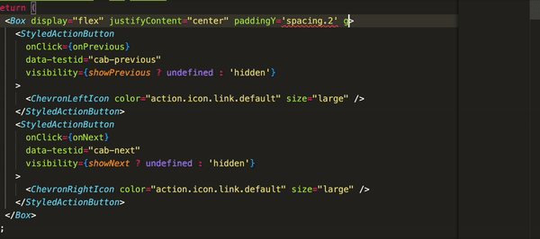
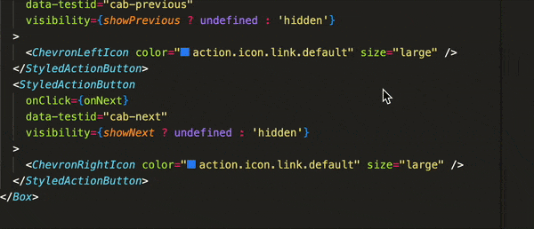

Razorpay Blade IntelliSense enhances the Blade development experience by providing Visual Studio Code users with detailed docs for tokens within the editor.

**[Install via the Visual Studio Code Marketplace →](https://marketplace.visualstudio.com/items?itemName=cseas.razorpay-blade-intellisense)**

## Features

### Token Details

Mapped values for Spacing tokens displayed within IntelliSense autocomplete.

### Color Previews

Previews for Color tokens are shown next to their usage within the editor.

